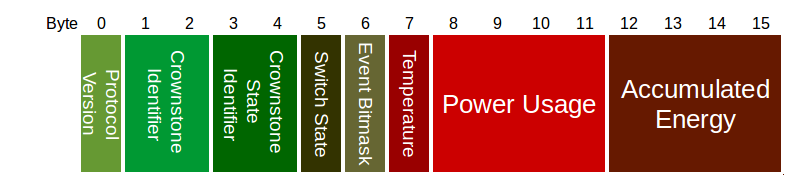

# Bluenet protocol v0.5.0
-------------------------

# Advertisements and scan response
When no device is connected, [advertisements](#ibeacon_packet) will be sent at a regular interval (100ms by default). A device that actively scans, will also receive a [scan response packet](#scan_response_packet). This contains useful info about the state.

### iBeacon advertisement packet
This packet is according to iBeacon spec, see for example [here](http://www.havlena.net/en/location-technologies/ibeacons-how-do-they-technically-work/).

Type | Name | Length | Description
--- | --- | --- | ---
uint 8 | AD Length | 1 | Length of the Flags AD Structure (0x02)
uint 8 | AD Type | 1 | Flags (0x01)
uint 8 | Flags | 1 |
uint 8 | AD Length | 1 | Length of the Manufacturer AD Structure  (0x1A)
uint 8 | AD Type | 1 | Manufacturer Specific Data (0xFF)
uint 8 | Company Id | 2 | Apple (0x004C)
uint 8 | iBeacon Type | 1 | IBeacon Type (0x02)
uint 8 | iBeacon Length | 1 | IBeacon Length (0x15)
uint 8 | Proximity UUID | 16 |
uint 16 | Major | 2 |
uint 16 | Minor | 2 |
int 8 | TX Power | 1 | Received signal strength at 1 meter.

### Scan response packet
The packet that is sent when a BLE central scans.

Type | Name | Length | Description
--- | --- | --- | ---
uint 8 | AD Length | 1 | Length of the Name AD Structure (0x0A)
uint 8 | AD Type | 1 | Shortened Local Name (0x08)
char []] | Name Bytes | 9 | The shortened name of this device.
uint 8 | AD Length | 1 | Length of the Service Data AD Structure (0x13)
uint 8 | AD Type | 1 | Service Data (0x16)
uint 16 | Service UUID | 2 | Service UUID
[Service data](#scan_response_servicedata_packet) | Service Data | 16 | Service data, state info.

### Scan response service data packet
This packet contains the state info. If encryption is enabled, it will be encrypted using AES 128 ECB using the Guest key.

Type | Name | Length | Description
--- | --- | --- | ---
uint 8 | Protocol Version | 1 | Service data protocol version
uint 16 | Crownstone ID | 2 | ID that identifies this Crownstone.
uint 16 | Crownstone state ID | 2 | ID of the Crownstone of which the state is shown.
uint 8 | [Switch state](#switch_state_packet) | 1 | The state of the switch.
uint 8 | Event bitmask | 1 | Shows if the Crownstone has something new to tell.
int 8 | Temperature | 1 | Chip temperature (°C)
int 32 | Power usage | 4 | The power usage at this moment (mW).
int 32 | Accumulated energy | 4 | The accumulated energy (kWh).

#### Switch State Packet

To be able to distinguish between switching with relay and switching with PWM, the switch state is a bit struct with
the following layout

Bit 7 is used for the Relay Flag, where 0 = OFF, 1 = ON
Bits 6-0 are used for PWM, where 100 is full ON, 0 is OFF, dimmed in between

# Services
When connected, the following services are available.

## Power service

The power service has UUID 24f30000-7d10-4805-bfc1-7663a01c3bff.

Characteristic | UUID | Date type | Description | A | U | G 
--- | --- | --- | --- | :---: | :---: | :---:
PWM                | 24f30001-7d10-4805-bfc1-7663a01c3bff | uint 8 | Set PWM value. Value of 0 is completely off, 255 (100 on new devices) is completely on. | x
Relay              | 24f30002-7d10-4805-bfc1-7663a01c3bff | uint 8 | Switch Relay. Value of 0 is off, other is on. | x
Power samples      | 24f30003-7d10-4805-bfc1-7663a01c3bff | [Power Samples](#power_samples_packet) | List of sampled current and voltage values. | x
Power consumption  | 24f30004-7d10-4805-bfc1-7663a01c3bff | uint 16 | The current power consumption. | x
